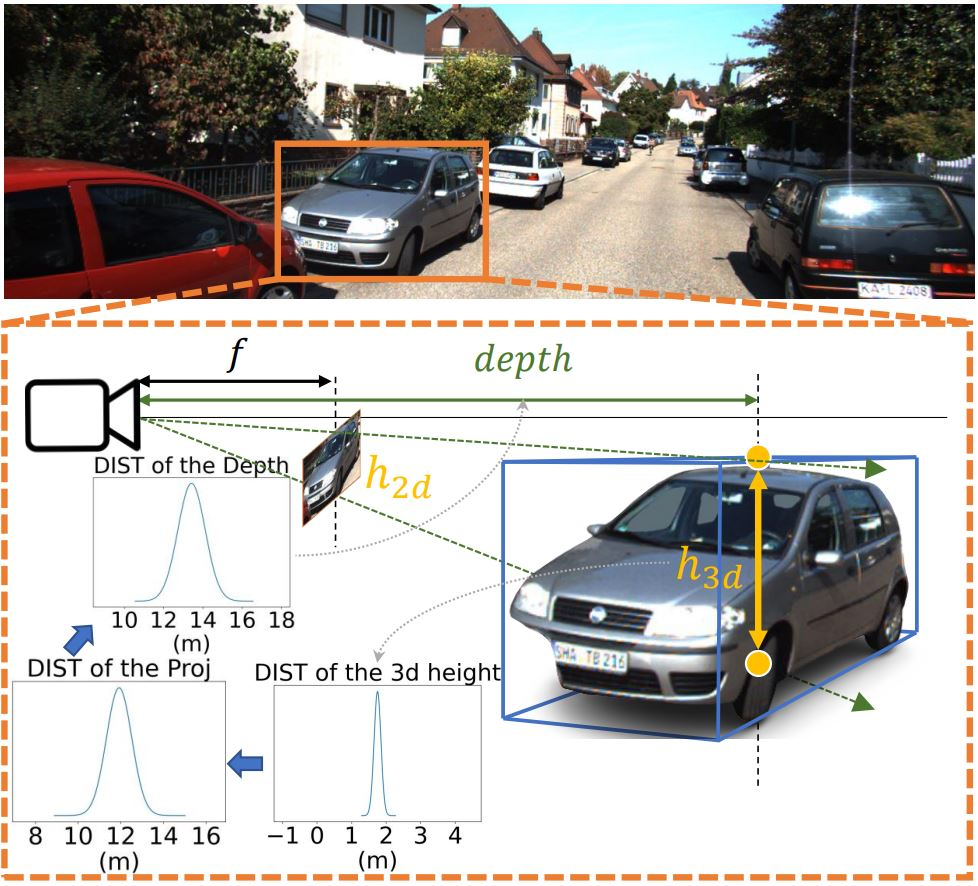

# GUPNet

This is the official implementation of "Geometry Uncertainty Projection Network for Monocular 3D Object Detection".

## citation

If you find our work useful in your research, please consider citing:

    @article{lu2021geometry,
    title={Geometry Uncertainty Projection Network for Monocular 3D Object Detection},
    author={Lu, Yan and Ma, Xinzhu and Yang, Lei and Zhang, Tianzhu and Liu, Yating and Chu, Qi and Yan, Junjie and Ouyang, Wanli},
    journal={arXiv preprint arXiv:2107.13774},year={2021}}

## Usage

### Train

Download the KITTI dataset from [KITTI website](http://www.cvlibs.net/datasets/kitti/eval_object.php?obj_benchmark=3d), including left color images, camera calibration matrices and training labels.

Clone this project and then go to the code directory:

    git clone https://github.com/SuperMHP/GUPNet.git
    cd code

We train the model on the following environments:

    Python 3.6
    Pytorch 1.1
    Cuda 9.0

You can build the environment easily by installing the requirements:

    pip install -r requirements.yml

Train the model:

    CUDA_VISIBLE_DEVICES=0,1,2 python tools/train_val.py

### Evaluate

After training the model will directly feedback the detection files for evaluation (If so, you can skip this setep). But if you want to test a given checkpoint, you need to modify the "resume" of the "tester" in the code/experiments/config.yaml and then run:

    python tools/train_val.py -e

After that, please use the kitti evaluation devkit (deails can be refered to [FrustumPointNet](https://github.com/charlesq34/frustum-pointnets)) to evaluate:

    g++ evaluate_object_3d_offline_apXX.cpp -o evaluate_object_3d_offline_ap
    ../../tools/kitti_eval/evaluate_object_3d_offline_apXX KITTI_LABEL_DIR ./output

We also provide the trained checkpoint which achieved the best multi-category performance on the validation set. It can be downloaded at [here](https://drive.google.com/file/d/1-iQEjNlWMGYC-wC4kN6We_TBbBmeKsmz/view?usp=sharing). This checkpoint performance is as follow:

<table align="center">
    <tr>
        <td rowspan="2",div align="center">Models</td>
        <td colspan="3",div align="center">Car@IoU=0.7</td>    
        <td colspan="3",div align="center">Pedestrian@IoU=0.5</td>  
        <td colspan="3",div align="center">Cyclist@IoU=0.5</td>  
    </tr>
    <tr>
        <td div align="center">Easy</td> 
        <td div align="center">Mod</td> 
        <td div align="center">Hard</td> 
        <td div align="center">Easy</td> 
        <td div align="center">Mod</td> 
        <td div align="center">Hard</td> 
        <td div align="center">Easy</td> 
        <td div align="center">Mod</td> 
        <td div align="center">Hard</td>  
    </tr>
    <tr>
        <td div align="center">original paper</td>
        <td div align="center">22.76%</td> 
        <td div align="center">16.46%</td> 
        <td div align="center">13.72%</td> 
        <td div align="center">-</td> 
        <td div align="center">-</td> 
        <td div align="center">-</td> 
        <td div align="center">-</td> 
        <td div align="center">-</td> 
        <td div align="center">-</td>  
    </tr>    
    <tr>
        <td div align="center">released chpt</td>
        <td div align="center">23.19%</td> 
        <td div align="center">16.23%</td> 
        <td div align="center">13.57%</td> 
        <td div align="center">11.29%</td> 
        <td div align="center">7.05%</td> 
        <td div align="center">6.36%</td> 
        <td div align="center">9.49%</td> 
        <td div align="center">5.01%</td> 
        <td div align="center">4.14%</td>  
    </tr>
</table>

### Test (I will modify this section to be more automatical in future)

Modify the train set to the trainval set (You can modify it in the code/libs/helpers/dataloader_helper.py), and then modify the input of the evaluation function to the test set (code/tools/train_val.py). 

Compressed the output file to a zip file (Please note that this zip file do NOT include any root directory):

    cd outputs/data
    zip -r submission.zip .

submit this file to the KITTI page (You need to register an account.)

We also give our trained checkpoint on the trainval dataset. You can download it from [here](https://drive.google.com/file/d/1ppvEoE8VlCQjoY_viPcYvdjTf7J2yi1w/view?usp=sharing). This checkpoint performance is as follow:

<table align="center">
    <tr>
        <td rowspan="2",div align="center">Models</td>
        <td colspan="3",div align="center">Car@IoU=0.7</td>    
        <td colspan="3",div align="center">Pedestrian@IoU=0.5</td>  
        <td colspan="3",div align="center">Cyclist@IoU=0.5</td>  
    </tr>
    <tr>
        <td div align="center">Easy</td> 
        <td div align="center">Mod</td> 
        <td div align="center">Hard</td> 
        <td div align="center">Easy</td> 
        <td div align="center">Mod</td> 
        <td div align="center">Hard</td> 
        <td div align="center">Easy</td> 
        <td div align="center">Mod</td> 
        <td div align="center">Hard</td>  
    </tr>
    <tr>
        <td div align="center">original paper</td>
        <td div align="center">20.11%</td> 
        <td div align="center">14.20%</td> 
        <td div align="center">11.77%</td> 
        <td div align="center">14.72%</td> 
        <td div align="center">9.53%</td> 
        <td div align="center">7.87%</td> 
        <td div align="center">4.18%</td> 
        <td div align="center">2.65%</td> 
        <td div align="center">2.09%</td>  
    </tr>
    <tr>
        <td div align="center">released chpt</td>
        <td div align="center">22.26%</td> 
        <td div align="center">15.02%</td> 
        <td div align="center">13.12%</td> 
        <td div align="center">14.95%</td> 
        <td div align="center">9.76%</td> 
        <td div align="center">8.41%</td> 
        <td div align="center">5.58%</td> 
        <td div align="center">3.21%</td> 
        <td div align="center">2.66%</td>  
    </tr>
</table>

## Other relative things

1. The releases code is originally set to train on multi-category here. If you would like to train on the single category (Car), please modify the code/experiments/config.yaml. Single-category training can lead to higher performance on the Car. 

2. This implementation includes some tricks that do not describe in the paper. Please feel free to ask me in the issue. And I will also update the principle of them in the [supplementary materials](https://github.com/SuperMHP/GUPNet/blob/main/pdf/supp.pdf)

3. The overall code cannot completely remove randomness because we use some functions which do not have reproduced implementation (e.g. ROI align). So the performance may have a certain degree of jitter, which is normal for this project. 

## Contact

If you have any question about this project, please feel free to contact yan.lu1@sydney.edu.au.